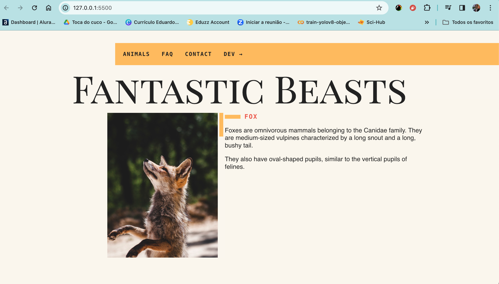
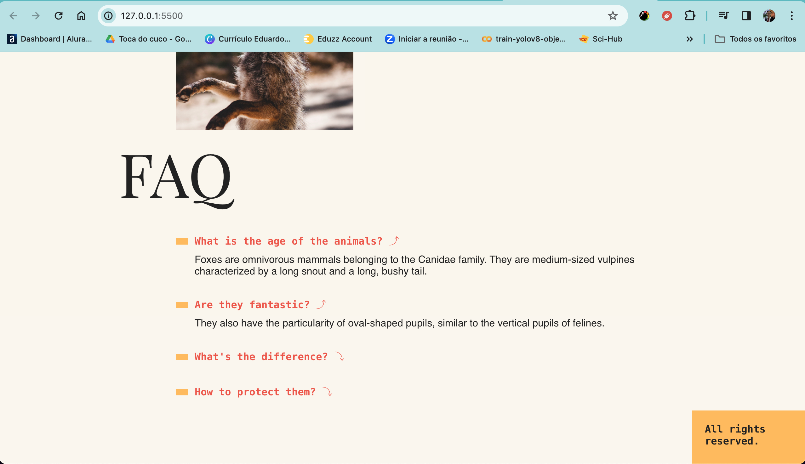

# Interactive Website with Dynamic Texts and JavaScript Animations

This project showcases an interactive website with dynamic text changes and the implementation of various JavaScript animations. The design of this website is both engaging and surprising, featuring navigation, an accordion list, event bubbling, modals, and a dropdown menu. Whether you're a developer or a user, you'll find something to enjoy on this site.


https://github.com/eduardowanderleyde/fantastic-bests-js-ES6-/assets/103546791/004d1833-ba85-4686-b603-0593addb5f04







## Features

- **Dynamic Texts:** Text content on this website changes to provide a more engaging user experience.

- **Interactive Animations:** JavaScript animations are applied throughout the site to create an immersive and visually appealing environment.

- **Navigation:** Users can easily navigate between different sections and pages of the website.

- **Accordion List:** The site includes an accordion list, allowing users to expand and collapse content sections with ease.

- **Event Bubbling:** Event bubbling is used to enhance user interactions and create a seamless browsing experience.

- **Modal Elements:** Modal windows provide additional information and interactions, enhancing user engagement.

- **Dropdown Menu:** A dropdown menu is integrated to access various parts of the website efficiently.

## Usage

To run this project locally, follow these steps:

1. Clone the repository:

   ```bash
   git clone https://github.com/eduardowanderleyde/animais-fantasticos)https://github.com/eduardowanderleyde/animais-fantasticos
